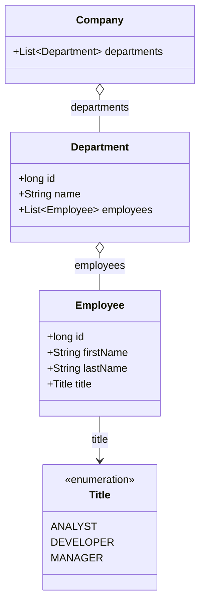

```mermaid
classDiagram
direction TD
class Company {
 +List~Department~ departments
}
class Department {
 +long id
 +String name
 +List~Employee~ employees
}
class Employee {
 +long id
 +String firstName
 +String lastName
 +Title title
}
class Title {
 <<enumeration>>
 ANALYST
 DEVELOPER
 MANAGER
}
Company o-- Department : departments
Department o-- Employee  : employees
Employee --> Title : title
```