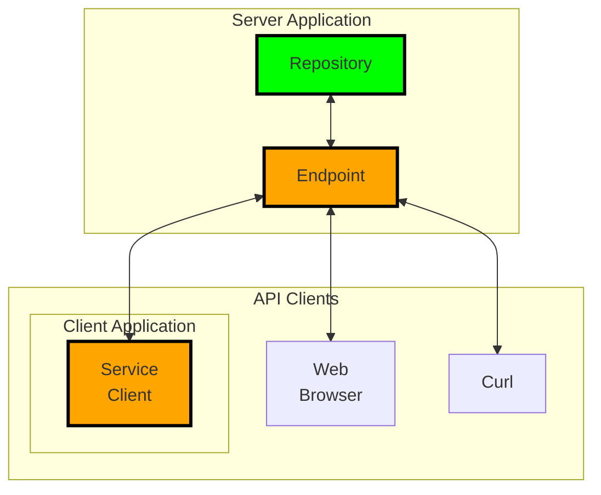

```mermaid
flowchart TD
 subgraph Server Application
  EDP[Endpoint]:::orangeBox
  REP[Repository]:::greenBox
 end
 subgraph API Clients
  subgraph Client Application
   SCL[Service\nClient]:::orangeBox
  end
  WBR[Web\nBrowser]
  CURL[Curl]
 end

 REP <--> EDP <--> SCL & WBR & CURL
 
 classDef greenBox   fill:#00ff00,stroke:#000,stroke-width:3px
 classDef orangeBox  fill:#ffa500,stroke:#000,stroke-width:3px
```
