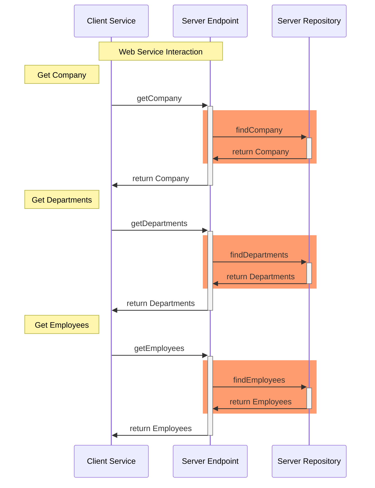

```mermaid
sequenceDiagram
 participant S as Client Service
 participant E as Server Endpoint
 participant R as Server Repository
 
 Note over S,E: Web Service Interaction
 
 Note left of S: Get Company
 S ->>+ E: getCompany
 rect rgb(255, 156, 111)
  E ->>+ R: findCompany
  R ->>- E: return Company
 end
 E ->>- S: return Company

 Note left of S: Get Departments
 S ->>+ E: getDepartments
 rect rgb(255, 156, 111)
  E ->>+ R: findDepartments
  R ->>- E: return Departments
 end
 E ->>- S: return Departments
 
 Note left of S: Get Employees
 S ->>+ E: getEmployees
 rect rgb(255, 156, 111)
  E ->>+ R: findEmployees
  R ->>- E: return Employees
 end
 E ->>- S: return Employees
```